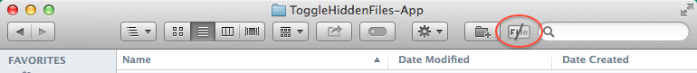

ToggleHiddenFiles.app
=====================
This is a simple App created using AppleScript commands. This app is intended to be used as a button docked in the toolbar inside a Finder window.

Note: It is currently not signed by a developer, so if you have Gatekeeper running (as you should) you will see a warning when you try to run it via double-clicking the app. 

##To use the app:
1. Download the App to your machine by either cloning or simply downloading the ZIP (stick it wherever you want, likely the Applications directory)
2. Right-click on the app and select open, at the prompt confirm that you want to open the app. The app will open and ask you if you are sure you want to change the status for showing hidden files, just click 'Cancel' for now. This step was only done to mark the app as trusted.
3. To add the app to your Finder toolbar, hold the Command button while dragging the app to the Finder toolbar
4. Now that the App is docked in the toolbar, you can use it by simply clicking the icon. You will be asked to confirm the change. If you confirm, the setting will be changed and Finder will be restarted for the setting to take effect. When complete, you will be prompted to reopen Finder.

- - -

When using the toggle feature of the app, the Finder App will be restarted. 
TODO: There may be ways around this or at least to open in the smae directory location you were in prior to restarting Finder.
